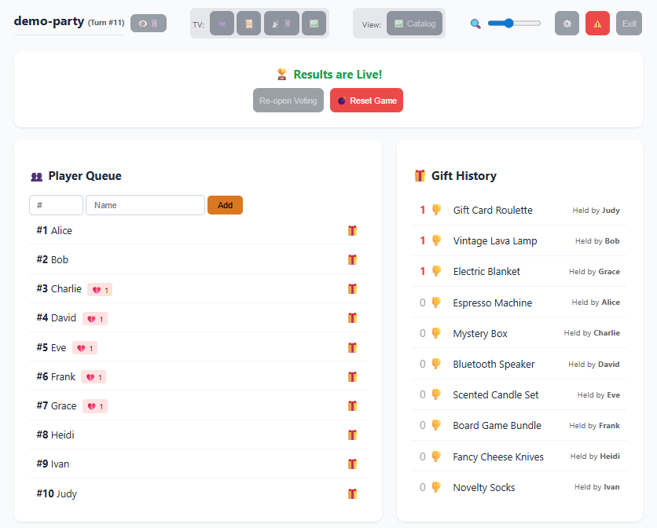

# 🐘 Elephant Exchange
**A Real-time, White-Label Gift Exchange Platform**

Elephant Exchange is a modern, full-stack web application designed to digitize and manage the chaos of "White Elephant" or "Yankee Swap" gift exchanges. It features a synchronized state machine that coordinates three distinct interfaces (Admin Dashboard, TV Scoreboard, and Mobile Guest View) in real-time.



## 🚀 Key Features

### 📡 Real-Time State Synchronization
* **Socket.io Architecture:** Instant state propagation across all devices. When the Admin clicks "Steal", the TV updates, the Victim's phone buzzes, and the Turn Timer resets simultaneously.
* **Multi-View System:**
    * **Admin Console:** Full control over game flow, gift edits, and player management.
    * **TV Scoreboard:** A cinematic, auto-scrolling display for the living room.
    * **Mobile Guest View:** Allows players to upload photos of their gifts and vote.

### 🎨 White-Label Branding Engine
* **Dynamic Theming:** Hosts can customize primary colors, background images, and logos on the fly.
* **Contrast Calculation:** Automatically calculates YIQ contrast ratios to ensure text remains legible (Black vs. White) regardless of the chosen theme color.

### 🗳️ "Worst Gift" Voting System
* **Multi-Phase Logic:** The application transitions through distinct states: `Active` → `Voting` → `Results`.
* **Live Polls:** Once the game ends, players use their phones to downvote the "Worst Gift". The TV updates a bar chart in real-time.
* **The Podium:** Automatically calculates and displays the winners (losers?) with a dynamic size hierarchy.

## 🛠️ Tech Stack

* **Backend:** Node.js, Express, Socket.io
* **Data Store:** Redis (chosen for sub-millisecond latency and simple key-value state management)
* **Frontend:** Vanilla JavaScript (ES6+), CSS3 Variables
* **Infrastructure:** Docker, Docker Compose

## 📦 Architecture

The application uses a **Singleton State Pattern** stored in Redis.
1.  **Clients** (Admin/TV) connect via WebSockets.
2.  **Mutations** (Open/Steal/Vote) are sent to the REST API.
3.  **Server** updates Redis and emits a `stateUpdate` event.
4.  **Clients** receive the new state and re-render efficiently using a virtual-DOM-lite approach.

## 🏃‍♂️ Quick Start (Docker)

1.  **Clone the Repo:**
    ```bash
    git clone [https://github.com/j2willey/Elephant-Exchange.git](https://github.com/j2willey/Elephant-Exchange.git)
    cd Elephant-Exchange
    ```

2.  **Launch:**
    ```bash
    docker compose up -d
    ```

3.  **Access:**
    * **Admin:** `http://localhost:3000`
    * **Mobile Test:** `http://localhost:3000/scoreboard.html?mode=mobile`

## 🧪 Testing
The project includes a robust seeding script to simulate a full 10-player game for UI testing.
    ```bash
    docker compose exec app node scripts/seed_full_game.js
    ```

Copyright (c) 2026 Jim Willey. Licensed under the MIT License.

